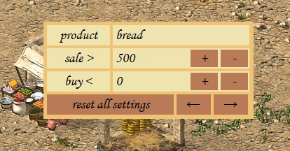

# Stronghold Crusader HD Conditional Trading

**Conditional Trading** is a modification for the game Stronghold Crusader HD that adds conditional trading functionality. This mod has been successfully tested with versions 1.3 and 1.41 of the game, both in Russian and English editions, and is also compatible with the Extreme version.



## How to Use

1. **Open/Close Menu:**
   - Press the `M` key to toggle the menu on or off.

2. **Product Selection:**
   - Use the `<-` and `->` arrow buttons to select the product you want to manage.

3. **Set Sale Threshold:**
   - The `sale >` field defines the threshold above which the product will be sold. If the stock quantity is greater than this value, the product will be sold.
   - You can increase or decrease this value using the + and - buttons. You can also hold down these buttons to continuously and rapidly adjust the value.

4. **Set Buy Threshold:**
   - The `buy <` field defines the threshold below which the product will be purchased. If the stock quantity is less than this value, the product will be purchased.
   - You can increase or decrease this value using the + and - buttons. You can also hold down these buttons to continuously and rapidly adjust the value.

5. **Default Settings:**
   - By default, all products have a `sale` threshold of 500 and an empty `buy` threshold.

6. **Reset Settings:**
   - The `reset` button will restore all user settings to their defaults for all products.

## Installation

1. Download the `dplayx.dll` file from the [Releases page](https://github.com/Ciptik/crusader-automarket/releases).
2. Place the `dplayx.dll` file in the root directory of your *Stronghold Crusader HD* game.
3. Now the mod is installed and you can run the game.

## Compilation from Source

To compile the mod from source, follow these steps:

1. **Install MSYS2:**
   - Download and install MSYS2 from [MSYS2.org](https://www.msys2.org/).

2. **Open MSYS2 MINGW32:**
   - Launch the MSYS2 MINGW32 terminal.

3. **Install Compilation Tools:**
   ```bash
   pacman -S git mingw-w64-i686-gcc mingw-w64-i686-make mingw-w64-i686-cmake
   
4. **Clone the Repository:**
   ```bash
   git clone --recurse-submodules https://github.com/Ciptik/crusader-automarket.git
   ```

5. **Go to the project folder**
   ```bash
   cd crusader-automarket
   ```

6. **Create a Build Directory:**
   ```bash
   mkdir build
   ```

7. **Navigate to the Build Directory:**
   ```bash
   cd build
   ```

8. **Generate Build Files with CMake:**
   ```bash
   cmake -G "MinGW Makefiles" ..
   ```

9. **Compile the Project:**
   ```bash
   mingw32-make
   ```

10. **Verify the Build:**
   - Upon successful compilation, the `dplayx.dll` file will be generated in the `build` directory. Move this file to the root directory of your *Stronghold Crusader HD* game to apply the mod.

## Project Support

If you find this project helpful, I would greatly appreciate your support. You can send donations to the following cryptocurrency address:

**TON:** `UQDQStE3LfvdbjDaPQuCSU8oXzkT_PUYmnO5CPD8-6k4ZdIf`
